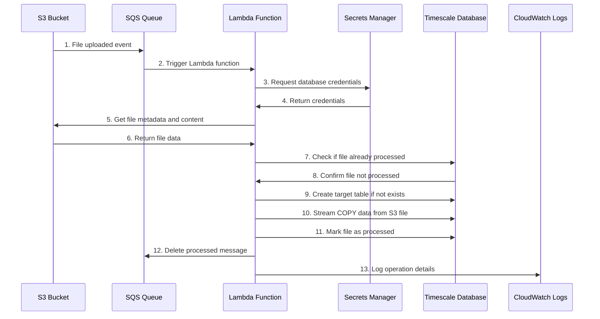
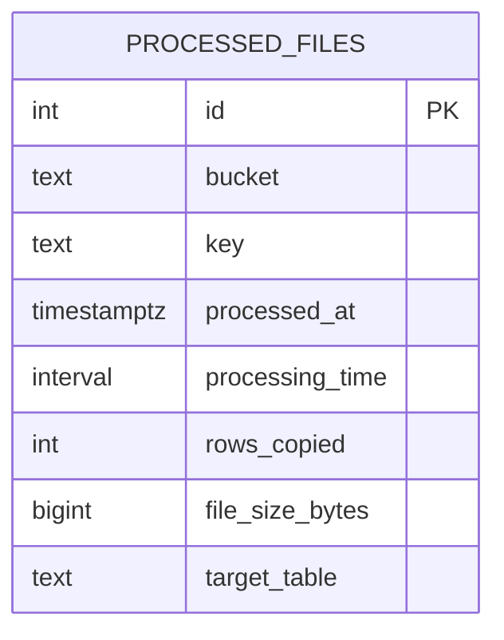

# timescale-s3-pipeline
This repo defines an AWS SAM template for a pipeline to ingest S3 files to Postgres with a Lambda. It can be deployed with a single command.

The pipeline happy path operates as follows:

## Features
- CSV files are imported to a table name that matches the top level S3 directory
- The `imported_files` table is created on first run if it doesn't exist
- Any error will result in the SQS message not being removed, which will trigger a retry after 5mins
- Files which have already been imported will not be re-imported (unless they are removed from `imported_files`)
- Full logging to CloudWatch
- Persistent failures will be routed to the SQS Dead Letter Queue for manual processing
  
## Non-goals
- Parallel import / multi-threading. If files take too long to import then reduce CSV size.

## Schema

The lambda will create the `processed_files` table on first run with the following schema. All files listed in this table have been ingested exactly once.

## Usage
### Pre-requisites
- Install the AWS `sam` (Serverless Application Model) client and configure it as [described here](https://docs.aws.amazon.com/serverless-application-model/latest/developerguide/install-sam-cli.html)
- Ensure that the API key you have configured has S3, SecretManager, Lambda and SQS permissions.

### Installation
- Run `sam deploy --guided --stack-name timescale-s3-pipeline`. The guided option will prompt you for all variable values, and then write the results to a file to re-use next time.
- ✅ Done

### Testing
- Create a subfolder in your ingest S3 bucket which matches the name of a table you want to ingest data into
- Drop a CSV file with the same format at the table into the new subfolder
- You should see the rows appear in your table, and import details show up in the new `processed_files` table.
- 🚀🚀🚀

### Uninstallation
- Remove all folders and files from your ingest S3 bucket manually (these will cause `sam delete` to fail, protecting your data)
- Run `sam delete`
- ❌ All components should be removed.

