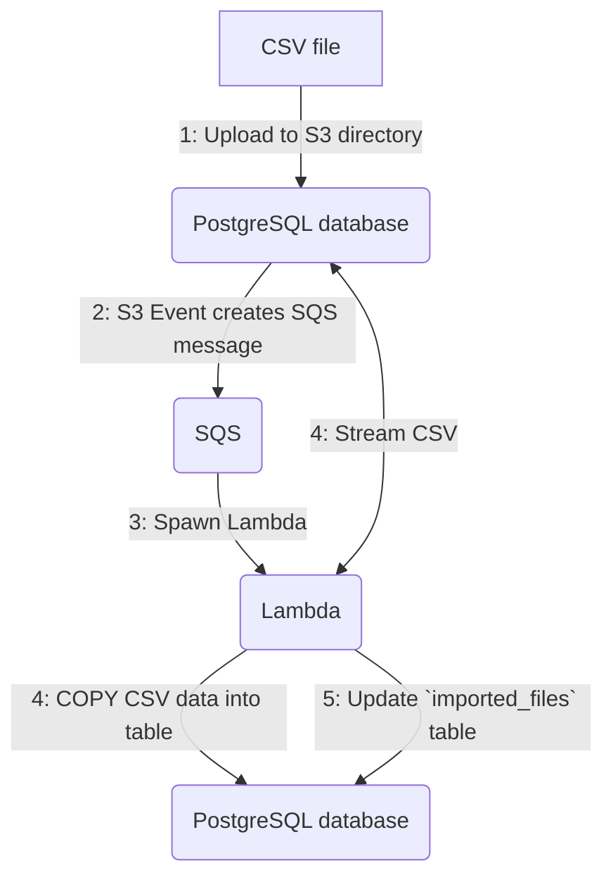

# timescale-s3-pipeline
This repo defines an AWS SAM template for a pipeline to ingest S3 files to Postgres with a Lambda. It can be deployed with a single command.

The pipeline operates as follows:

## Pre-requisites
- Install the `sam` client and configure it as (described here)[https://docs.aws.amazon.com/serverless-application-model/latest/developerguide/install-sam-cli.html]
- Ensure that the API key you have configured has S3, SecretManager, Lambda and SQS permissions.

## Installation
- Run `sam deploy --guided`. The guided option will prompt you for all variable values, and then write the results to a file to re-use next time.
- ✅ Done

## Testing
- Create a subfolder in your ingest S3 bucket which matches the name of a table you want to ingest data into
- Drop a CSV file with the same format at the table into the new subfolder
- You should see the rows appear in your table, and import details show up in the new `processed_files` table.
- 🚀🚀🚀

## Uninstallation
- Remove all folders and files from your ingest S3 bucket manually (these will cause `sam delete` to fail, protecting your data)
- Run `sam delete`
- ❌ All components should be removed.

## Non-goals
- Parallel import / multi-threading. If files take too long to import then reduce CSV size. 

